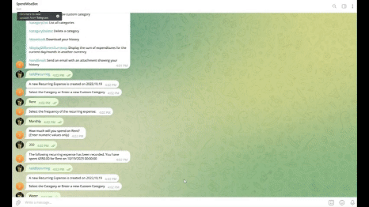
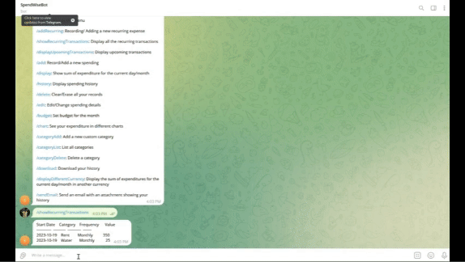
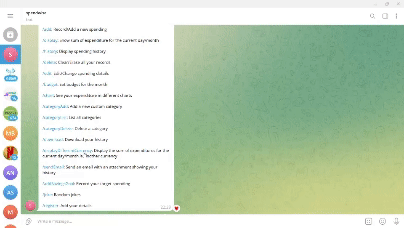

# :money_with_wings: Spendwise

<hr>
<p align="center">
<a></a>
</p>
<hr>


[](https://zenodo.org/badge/latestdoi/431190543)
[](https://desktop.telegram.org/)
[](https://codecov.io/gh/nitin-dhevar/spendwise)
[](https://github.com/mtkumar123/MyDollarBot/actions)


<hr>

## Demo Video

https://youtu.be/cAGcWJTWelc

## About Spendwise

Spendwise is an easy-to-use Telegram Bot that assists you in recording your daily expenses on a local system without any hassle.  With SpendWise, users can easily record and categorize their spending, set budgets, visualize expenditure patterns, and more, all within the familiar Telegram interface.
With simple commands, this bot allows you to:
- Add/Record a new spending based on personal or shared expense actegory
- Add/Record recurring transactions
- Display recurring transactions
- Display upcoming transactions
- Provide Email Alerts when monthly expenses exceeds the savings goal or budget
- Real time currency conversion using public APIs
- Personalised user information stored
- Monthly budget chart
- Show the sum of your expenditure for the current day/month
- Display your spending history
- Clear/Erase all your records
- Edit/Change any spending details if you wish to
- Download your expenditure history in the CSV format
- Visualize your spendings in the form of graphs/pie chart using the /chart option
- Email the history CSV file to yourself
- See the total daily/monthly expenditure in different currencies

Check out the bot here: https://t.me/spend_vise_bot

---
Sample demos are shown below. They are run on a local machine.

- [:information_desk_person: Sample Demos](#information_desk_person-Sample-Demos)


---

# :star: Whats New

### Release Version 2.0.0 - Spendwise

- Add your total daily/monthly expenditure according to expense category (Personal or Shared)
- Add/Record recurring transactions (e.g. Rent, Utilities etc.)
- Display recurring transactions when asked
- Display upcoming transactions
- Send an email notification for depicting savings information
- Currency conversion in real time scenarios
- Making user information personalized like mail_id, name


<!-- [comment]: <> (## Demo) -->

<!-- [comment]: <> (https://user-images.githubusercontent.com/15325746/135395315-e234dc5e-d891-470a-b3f4-04aa1d11ed45.mp4) -->


# :rocket: Installation Guide

## 💻For users 
Check out the bot here: https://t.me/spend_vise_bot

## 💻For developers 
1. Install Python, atleast Python3

2. Clone this repository to your local system at a suitable directory/location of your choice

3. Start a terminal session, and navigate to the directory where the repo has been cloned

4. Run the following command to install the required dependencies:
```
  pip install -r requirements.txt
```
5. Download and install the Telegram desktop application for your system from the following site: https://desktop.telegram.org/

6. Once you login to your Telegram account, search for "BotFather" in Telegram. Click on "Start" --> enter the following command:
```
  /newbot
```
7. Follow the instructions on screen and choose a name for your bot. Post this, select a username for your bot that ends with "bot" (as per the instructions on your Telegram screen)

8. BotFather will now confirm the creation of your bot and provide a TOKEN to access the HTTP API - copy this token for future use.

9. Search for "Edit the system environment variables" on your local computer. Click on Environment Variables and create a new System Variable called "API_TOKEN" and paste the token copied in step 8.

10. In the Telegram app, search for your newly created bot by entering the username and open the same. Once this is done, go back to the terminal session. 
Make sure you export the PYTHONPATH variable to the main project folder
 ```
 python src/bot.py
```
11. A successful run will generate a message on your terminal that says "TeleBot: Started polling." 
12. Post this, navigate to your bot on Telegram, enter the "/start" or "/menu" command, and you are all set to track your expenses!

For more info on deployment(Heroku), check out the doc [here](https://github.com/mtkumar123/MyDollarBot/blob/main/CONTRIBUTING.md#more-tips-for-developers)


## 💻For testing with Pytest
1. Some modules in testing require CHAT_ID environment variable to be set.
2. This is the specific ID that is maintained for your chat with the Bot.
3. While running the bot.py , get this id from line 72 and set it in your system environment variables.
4. This should ensure effective running of all tests.


# :information_desk_person: Sample Demos

### Budget

I want to increase/decrease my monthly budget.

<p align="center"></p>

1. Enter the `/budget` command
2. Enter the new budget amount (must be greater than 0)


### Add

I want to add the expenses based on personal or shared category

<p align="center"></p>

1. Enter the `/add` command
2. Click on the date of the transaction
3. Click on the category to add
4. Type in the amount spent
5. Type the expenditure category "Personal" or "Shared"
6. The amount will be added to the total value

### Add Recurring

I want to add the repetitive transactions

<p align="center"></p>

1. Enter the `/addRecurring` command
2. Click the category
3. Click the frequency

### Display Recurring Transactions

I want to see the recurring transactions

<p align="center"></p>

1. Enter the `/showRecurringTransactions` command

### Show upcoming transactions

I want to see the transactions which are upcoming

<p align="center"></p>


1. click '/displayUpcomingTransactions'

### Jokes

I am tired I want to listen to some jokes

<p align="center"></p>

1. Enter '/joke' command

### See total Expenditure in different currencies

I want to convert my total daily or monthly expenditure in a different currency.

<p align="center"></p>

1. Enter the /displayDifferentCurrency command
2. Choose from the category of day or month
3. Next, Choose your currency from the options
4. You will get the converted price in that currency


### SendEmail 

I want to send myself an email for the savings record


<p align="center"></p>

1. Make sure you add savings using '/addSavingsGoal' command
2. When you are exhausted your limit it will send you an email

# :grey_question: Documentation

The Documentation of the SpendWise application API, can be viewed at [Link to Documentation](https://github.com/nitindhevar/spendwise/blob/main/proj2/Documentation%20SpendWise.pdf) and the Agile Project Board Status which includes the features developed and the new features that can be added to the application at [Agile Project Board Status](https://github.com/nitin-dhevar/spendwise/blob/main/proj2/AgileProjectBoardStatus.jpeg). For additional reference, refer to [Github Pages](https://mtkumar123.github.io/MyDollarBot/).

# :construction: Road Map

Our ideas for new features that can be implemented to make this project better can be seen in our RoadMap project board.
[Road Map](https://github.com/nitin-dhevar/spendwise/projects/1)


:heart: Acknowledgements
---
We would like to thank Dr. Timothy Menzies for helping us understand the process of building a good Software Engineering project. We would also like to thank the teaching assistants Andre Lustosa, San Gilson, Xueqi (Sherry) Yang, Yasitha Rajapaksha, Rahul Yedida for their support throughout the project.


:page_facing_up: License
---
This project is licensed under the terms of the MIT license. Please check [License](https://github.com/nitin-dhevar/spendwise/blob/main/LICENSE) for more details.


:sparkles: Contributors
---

<table>
  <tr>
    <td align="center"><a href="https://github.com/nitin-dhevar/"><br /><sub><b>Nitin Dhevar</b></sub></a></td>
    <td align="center"><a href="https://github.com/GVSPraveen113"><br /><sub><b>Venkata Sai Praveen</b></sub></a><br /></td>
    <td align="center"><a href="https://github.com/manideepika21"><br /><sub><b>Mani Deepika</b></sub></a><br /></td>
  </tr>
</table>


# :calling: Support

For any support, email us at spendwisebot@gmail.com / mydollarbot@gmail.com / secheaper@gmail.com
